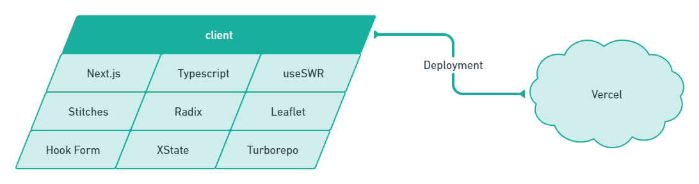

### @fybf/client

Esse é projeto client do Find Your Best Friend. O projeto consiste em um mono-repositório utilizando o [Turborepo](https://turborepo.org/) para gerenciar os pacotes.

### Arquitetura

A arquitetura do projeto segue o seguinte diagrama:



### Pacotes

O mono-repositório é composto pelos seguintes pacotes:

- [@fybf/web](packages/apps/web): Aplicação principal Next.js
- [@fybf/config.\*](packages/config): Configurações de projeto (eslint, tsconfig, etc...)
- [@fybf/shared.\*](packages/shared): Biblioteca compartilhada entre os pacotes (componentes, tema, etc...)

### Uso

Para rodar o projeto localmente, primeiro deve-se instalar as dependências:

```bash
yarn # ou npm install
```

Depois, deve-se rodar o projeto:

```bash
yarn dev # ou npm run dev
```

Outros comandos também estão disponíveis no [package.json](package.json).
